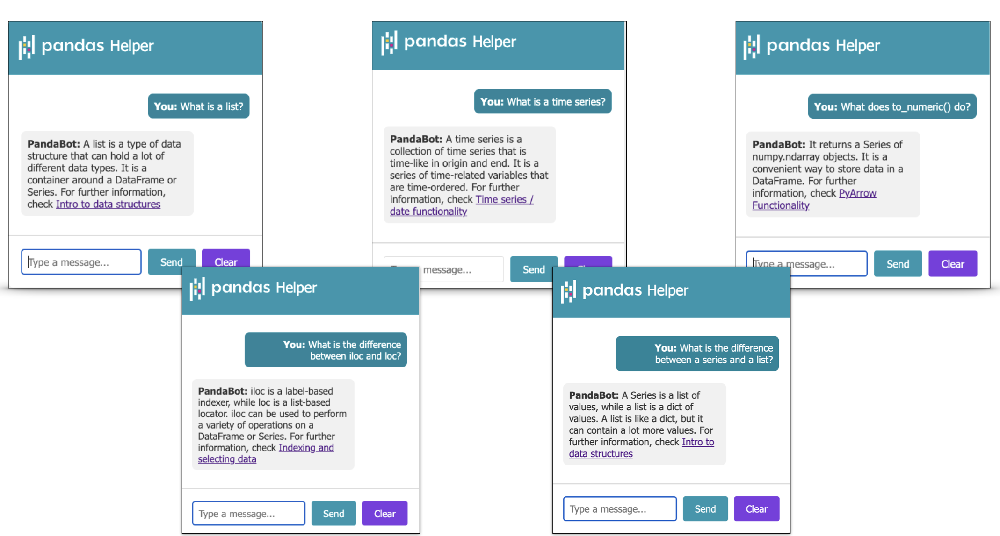

# 👋 Hi, I'm Bijit Kundu  
### Data Analytics Professional | SQL, Python, Power BI, Excel, BigQuery, Dashboard automation  
📍 Perth, Western Australia | 💼 Available from 1 Dec, 2025  

---

## 🧭 About Me
- I’m a data-driven professional with 3.5+ years of experience supporting large-scale web applications for government clients and managing complex data processes.  
- Recently, I completed a **Data Science and Artificial Intelligence Program (Curtin University x Institute of Data)** - where I strengthened my skills in **SQL, Python, AI/ML and data storytelling**.  
- I’m passionate about transforming raw data into actionable insights, automating reporting workflows, and building intuitive dashboards that empower decision-making.

---

## 🧰 Tech Stack

**Languages & Tools:**  
SQL · Python (pandas, NumPy) · Power BI · Power Query · DAX · Excel (Pivot, VBA) · Power Automate · BigQuery · Git · Docker  

---

## 📊 Featured Projects

### [🌍 FX Exchange Rates Data Platform (AUD-Centric)](https://github.com/bijit-kundu/exchange-rates)
**Tools:** Python · GitHub Actions · BigQuery · Looker Studio  

A fully automated end-to-end foreign-exchange analytics platform developed to analyse how the Australian Dollar (AUD) moves against leading global currencies.
- The system ingests historical and daily exchange-rate data from [ExchangeRatesAPI](https://exchangeratesapi.io/), processes it through a Python ETL workflow, and loads curated fact and dimension tables into BigQuery.
- A scheduled GitHub Actions pipeline retrieves fresh data daily, normalizes JSON responses, regenerates calendar and currency dimensions, enriches records with Perth-timezone metadata, and performs incremental MERGE operations to maintain clean, deduplicated BigQuery tables.
- The platform also includes a public Looker Studio dashboard, powered by aggregated BigQuery views, showcasing detailed insights such as long-term AUD trends, daily movements, monthly averages, weekday patterns, and min–max–current rate summaries across major global currencies.  
👉 [Live Dashboard](https://lookerstudio.google.com/s/li-skA7iOf0)

---

### 🟢 [Mining Analytics Dashboard](./powerbi-mining-analytics/)
**Tools:** SQL · Power BI · DAX

An end-to-end analytics solution to monitor production KPIs and equipment efficiency.  
- Integrated CSV data sources to display real-time mining performance metrics.  
- Utilised DAX measures to calculate equipment utilisation rates.   

📸 *Preview:*  
  
  
  

---
<!--
### ⚙️ [Dashboard Automation Script](./dashboard-automation-python)
**Tools:** Python · Pandas · smtplib  

Developed a Python automation pipeline that exports daily KPIs from SQL and emails reports to stakeholders.  
- Reduced manual reporting time by 40%.  
- Implemented error handling and logging for production use.  

📸 *Demo:*  

-->
---

### 🤖 [Generative AI Chatbot for Pandas](https://github.com/bijit-kundu/pandas-helper)
**Tools:** Python · nltk · spacy · transformers

A local AI-powered chatbot designed to help users explore the Pandas library.  
- Assists users in retrieving general information about Pandas-related keywords and guides them to the most relevant chapter for deeper insights.  
- Demonstrated strong contextual understanding and accurate chapter classification in responses. 
  
📸 *Preview:*  
  
  
🎥 *Demo:*  

  
---
<!--
### 📘 [SQL Portfolio](./sql-portfolio)
**Tools:** PostgreSQL · MySQL  

A curated collection of advanced SQL queries, covering:  
- Window functions, CTEs, and joins  
- Business case analytics and reporting queries  
- Example datasets and data dictionaries  
-->
---

## 📈 Data Science & Analytics Learning Projects
In addition to professional experience, I’ve completed hands-on projects in:  
- **Predictive Analytics** - regression models on public datasets  
- **Data Visualisation** - Power BI dashboards for sales and operations  
- **Data Cleaning** - using Python & pandas to handle missing and inconsistent data  
- **Automation** - combining Power BI refresh and Python scheduling  

---

## 🏆 Education

🎓 **Data Science & AI Program - Curtin University x Institute of Data (2024)**  
🎓 **Applied Data Analysis Skill Set - North Metropolitan TAFE (2023)**  
🎓 **Master of Computer Applications - 8.29 DGPA (2012)**  

---

## 💡 What I’m Focusing On
- Enhancing my Power BI and DAX automation workflows, including building pipelines to automate the end-to-end data flow.  
- Expanding Python data visualization projects using Plotly, Matplotlib, and Taipy.  
- Building a portfolio of interactive analytics dashboards that demonstrate actionable insights and automation capabilities. 

---  

## 🧠 Recent Learnings
- 🏫 Completed [Introduction to Data Modeling for Power BI – SQLBI](https://www.sqlbi.com/p/introduction-to-data-modeling-for-power-bi-video-course/) - a 100-minute course covering dimensional modelling, star schemas and data model design.

- 📺 Watched [Dimensional Modelling Explained by Bryan Cafferky](https://www.youtube.com/watch?v=lWPiSZf7-uQ) - excellent breakdown of facts, dimensions, and star schemas.
  
---  

## 📬 Connect with Me

  
📧 [bijit.kundu@yahoo.com](mailto:bijit.kundu@yahoo.com)  
<!--🌐 [Power BI Portfolio (if hosted online)](https://app.powerbi.com/view?r=your-report-link)  -->

---

⭐ **Tip:**  
If you like my work, feel free to star a repository or connect on LinkedIn - I’m always open to collaborations, data projects, and analytics discussions.
